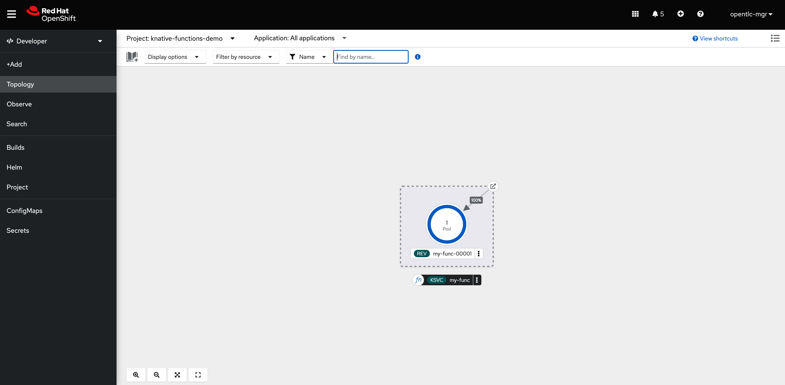

# OpenShift Serverless

## New Features in OpenShift Serverless 1.26

- OpenShift Serverless Functions with Quarkus is now GA.
- OpenShift Serverless now uses Knative Serving 1.5.
- OpenShift Serverless now uses Knative Eventing 1.5.
- OpenShift Serverless now uses Kourier 1.5.
- OpenShift Serverless now uses Knative (kn) CLI 1.5.
- OpenShift Serverless now uses Knative Kafka 1.5.
- OpenShift Serverless now uses Knative Operator 1.3.
- The kn func CLI plugin now uses func 1.8.1.
- Persistent volume claims (PVCs) are now GA. PVCs provide permanent data storage for your Knative services.

- The new trigger filters feature is now available as a Developer Preview. It allows users to specify a set of filter expressions, where each expression evaluates to either true or false for each event.

- To enable new trigger filters, add the new-trigger-filters: enabled entry in the section of the KnativeEventing type in the operator config map:

```yaml
apiVersion: operator.knative.dev/v1alpha1
kind: KnativeEventing
...
...
spec:
  config:
    features:
      new-trigger-filters: enabled
...
```

## Install the Knative CLI

Please install the [Knative CLI](https://docs.openshift.com/container-platform/4.12/serverless/cli_tools/installing-kn.html) and verify it is working:

```sh
$ kn version
Version:      v1.5.0
Build Date:   2022-11-28 05:38:27
Git Revision: b640d516
Supported APIs:
* Serving
  - serving.knative.dev/v1 (knative-serving v1.5.0)
* Eventing
  - sources.knative.dev/v1 (knative-eventing v1.5.0)
  - eventing.knative.dev/v1 (knative-eventing v1.5.0)
```

The functions plugin is included in Red Hats's distribution of kn. Verify the functions plugin version:

```sh
$ kn func version
v1.8.1
```

## Creating a basic Quarkus Serverless Function

1. Make sure you have [installed OpenShift Serverless](https://docs.openshift.com/container-platform/4.12/serverless/install/install-serverless-operator.html)

2. Create an OpenShift project

```sh
$ oc new-project knative-functions-demo
```

3. Create a new Quarkus Functions project

You can list the available languages

```sh
$ kn func languages
go
node
python
quarkus
rust
springboot
typescript
```

and create the functions project

```sh
$ kn func create my-func -l quarkus -t cloudevents
```

When you create a Quarkus function by using the Knative (kn) CLI, the project directory looks similar to a typical Maven project.

```sh
$ tree .
.
├── Readme.md
└── my-func
    ├── README.md
    ├── func.yaml
    ├── mvnw
    ├── mvnw.cmd
    ├── pom.xml
    └── src
        ├── main
        │   ├── java
        │   │   └── functions
        │   │       ├── Function.java
        │   │       ├── Input.java
        │   │       └── Output.java
        │   └── resources
        │       └── application.properties
        └── test
            └── java
                └── functions
                    ├── FunctionTest.java
                    └── NativeFunctionIT.java

9 directories, 12 files
```

Additionally, the project contains the `func.yaml` file, which is used for configuring the function. 

```yaml
specVersion: 0.34.0
name: my-func
runtime: quarkus
registry: ""
image: ""
imageDigest: ""
created: 2023-01-31T09:18:52.665817+01:00
invocation:
  format: cloudevent
build:
  buildpacks: []
  builder: ""
  buildEnvs:
  - name: BP_NATIVE_IMAGE
    value: "false"
  - name: BP_MAVEN_BUILT_ARTIFACT
    value: func.yaml target/quarkus-app/lib/ target/quarkus-app/*.jar target/quarkus-app/app/
      target/quarkus-app/quarkus/
  - name: BP_MAVEN_BUILD_ARGUMENTS
    value: package -DskipTests=true -Dmaven.javadoc.skip=true -Dquarkus.package.type=fast-jar
  - name: MAVEN_S2I_ARTIFACT_DIRS
    value: target/quarkus-app
  - name: S2I_SOURCE_DEPLOYMENTS_FILTER
    value: lib quarkus-run.jar app quarkus
run:
  volumes: []
  envs: []
deploy:
  namespace: ""
  annotations: {}
  options: {}
  labels: []
  healthEndpoints:
    liveness: /health/liveness
    readiness: /health/readiness
```

You can now add your dependencies in the pom.xml and begin with the actual implementation of your function. 

The function can respond to cloud events, or to simple HTTP requests. Cloud events in Knative are transported over HTTP as a POST request, so either function type can listen and respond to incoming HTTP requests.

Please have a look in the [documentation](https://docs.openshift.com/container-platform/4.12/serverless/functions/serverless-developing-quarkus-functions.html#serverless-invoking-quarkus-functions_serverless-developing-quarkus-functions) for further information.

4. Build the function locally

Building a function creates an OCI container image for your function that can be pushed to a container registry. It does not run or deploy the function

```sh
$ kn func build -v

...
...

Step 9/9 : CMD /usr/local/s2i/run
 ---> Running in 64ca08990cfb
 ---> 0fecd25342d7
 ---> 0fecd25342d7
Successfully built 0fecd25342d7
Successfully tagged image-registry.openshift-image-registry.svc:5000/knative-functions-demo/my-func:latest
🙌 Function image built: image-registry.openshift-image-registry.svc:5000/knative-functions-demo/my-func:latest
```

5. Run the function locally

Running a function creates an OCI container image for your function before running the function in your local environment, but does not deploy the function to a cluster.

```sh
$ kn func run -v

Function already built.  Use --build to force a rebuild.
Function started on port 8080
Starting the Java application using /opt/jboss/container/java/run/run-java.sh ...
INFO exec  java -XX:+UseParallelGC -XX:MinHeapFreeRatio=10 -XX:MaxHeapFreeRatio=20 -XX:GCTimeRatio=4 -XX:AdaptiveSizePolicyWeight=90 -XX:+ExitOnOutOfMemoryError -cp "." -jar /deployments/quarkus-run.jar
__  ____  __  _____   ___  __ ____  ______
 --/ __ \/ / / / _ | / _ \/ //_/ / / / __/
 -/ /_/ / /_/ / __ |/ , _/ ,< / /_/ /\ \
--\___\_\____/_/ |_/_/|_/_/|_|\____/___/
2023-01-31 08:52:21,674 INFO  [io.quarkus] (main) function 1.0.0-SNAPSHOT on JVM (powered by Quarkus 2.7.6.Final-redhat-00006) started in 2.944s. Listening on: http://0.0.0.0:8080
2023-01-31 08:52:21,711 INFO  [io.quarkus] (main) Profile prod activated.
2023-01-31 08:52:21,711 INFO  [io.quarkus] (main) Installed features: [cdi, funqy-knative-events, smallrye-context-propagation, smallrye-health, vertx]
````

6. Invoke the running function

We can now send requests to our function by either using curl or the kn invoke command. This command can be used to test that a function is working and able to receive HTTP requests and CloudEvents correctly.

If the function is running locally, func invoke sends a test request to the local instance.
Our function is expecting to handle Cloud Events.

```sh
$ kn func invoke

Received response
Context Attributes,
  specversion: 1.0
  type: function.output
  source: function
  id: 26dcfad8-5259-41ed-b1f6-e760b49fbc17
  datacontenttype: application/json
Data,
  {
    "message": "{\"message\":\"Hello World\"}"
  }
```

We can of course specify several options i.e using other input data, format, target address and more.

```sh
$ kn func invoke -f=cloudevent -t="http://localhost:8080" --data="Hello Ortwin"

Received response
Context Attributes,
  specversion: 1.0
  type: function.output
  source: function
  id: 311d276d-b840-4561-a0c3-7b1d77df6452
  datacontenttype: application/json
Data,
  {
    "message": "Hello Ortwin"
  }
```

7. Deploy the function to OpenShift

Deploying a function creates an OCI container image for your function, and pushes this container image to your image registry. The function is deployed to the cluster as a Knative Service. Redeploying a function updates the container image and resulting Service that is running on your cluster. Functions that have been deployed to a cluster are accessible on the cluster just like any other Knative Service.

```sh
$ kn func deploy -v

...
...
Successfully built f2fabbec08d8
Successfully tagged image-registry.openshift-image-registry.svc:5000/knative-functions-demo/my-func:latest
🙌 Function image built: image-registry.openshift-image-registry.svc:5000/knative-functions-demo/my-func:latest
Pushing function image to the registry "image-registry.openshift-image-registry.svc:5000" using the "openshift" user credentials
progress: 100%
⬆️  Deploying function to the cluster
Waiting for Knative Service to become ready
Starting the Java application using /opt/jboss/container/java/run/run-java.sh ...
INFO exec  java -Xms192m -Xmx768m -XX:+UseParallelGC -XX:MinHeapFreeRatio=10 -XX:MaxHeapFreeRatio=20 -XX:GCTimeRatio=4 -XX:AdaptiveSizePolicyWeight=90 -XX:+ExitOnOutOfMemoryError -cp "." -jar /deployments/quarkus-run.jar
__  ____  __  _____   ___  __ ____  ______
 --/ __ \/ / / / _ | / _ \/ //_/ / / / __/
 -/ /_/ / /_/ / __ |/ , _/ ,< / /_/ /\ \
--\___\_\____/_/ |_/_/|_/_/|_|\____/___/
2023-01-31 09:16:43,214 INFO  [io.quarkus] (main) function 1.0.0-SNAPSHOT on JVM (powered by Quarkus 2.7.6.Final-redhat-00006) started in 2.784s. Listening on: http://0.0.0.0:8080
2023-01-31 09:16:43,219 INFO  [io.quarkus] (main) Profile prod activated.
2023-01-31 09:16:43,219 INFO  [io.quarkus] (main) Installed features: [cdi, funqy-knative-events, smallrye-context-propagation, smallrye-health, vertx]
Function deployed in namespace "knative-functions-demo" and exposed at URL:
https://my-func-knative-functions-demo.apps.cluster-pnc6l.pnc6l.sandbox52.opentlc.com
✅ Function deployed in namespace "knative-functions-demo" and exposed at URL:
   https://my-func-knative-functions-demo.apps.cluster-pnc6l.pnc6l.sandbox52.opentlc.com
```

Now let's invoke the function in the cluster. If the function is also running locally, we can use the `--target` flag to select the function on the cluster.

```sh
$ kn func invoke -f=cloudevent --target=remote --data="Hello OpenShift"

Received response
Context Attributes,
  specversion: 1.0
  type: function.output
  source: function
  id: ef61f163-9217-45b7-a49d-81ea371c5242
  datacontenttype: application/json
Data,
  {
    "message": "Hello OpenShift"
  }
```

We can verify that the function is deployed as a Knative Service by listing the Knative services

```sh
$ kn services list
NAME      URL                                                                                     LATEST          AGE     CONDITIONS   READY   REASON
my-func   https://my-func-knative-functions-demo.apps.cluster-pnc6l.pnc6l.sandbox52.opentlc.com   my-func-00001   7m37s   3 OK / 3     True
```

 

## Configuring storage for Knative functions

One of the new GA features is the PVC support for Knative services. And as our serverless function is deployed as a Knative service we can use PVCs to read data from or write data to storage.

In order to use PVCs, we have to enable the extension in the Knative Serving configuration. This can be done by configuring the `config-features` configmap in the knative-serving namespace

Let's have a look at the configmap.

```sh
oc get cm config-features -n knative-serving -o yaml
```

Configure 
`kubernetes.podspec-persistent-volume-claim: "enabled"` and 
`kubernetes.podspec-persistent-volume-write: "enabled"` if you also want to write to the PVC, directly under the data section. Don't modify `_example:`

```yaml
kind: ConfigMap
apiVersion: v1
metadata:
  ...  
  name: config-features
  namespace: knative-serving
  labels:
    app.kubernetes.io/component: controller
    app.kubernetes.io/name: knative-serving
    app.kubernetes.io/version: 1.5.0
data:
  kubernetes.podspec-persistent-volume-claim: "enabled"
  kubernetes.podspec-persistent-volume-write: "enabled"
  _example: >-
  ...
```

In the next step we create the PVC. OpenShift Serverless is autoscaling our serverless services and functions, so we should consider using the right storage type like NFS i.e. with an access mode of `ReadWriteMany` in order to mount the PVC from multiple pods and nodes.
Now in this scenario the cluster only provides block storage, but we can still make use of it.

Let's first create the PVC.

```sh
oc apply -f k8s/pvc.yaml
```

Now we have to configure the volume configuration in the Knative Service CR. Edit the `my-func` service and add the volume configuration:

```yaml
apiVersion: serving.knative.dev/v1
kind: Service
metadata:
  name: my-func
  namespace: knative-functions-demo
  ...
spec:
  template:
    metadata:
    ...
    spec:
      volumes:
        - name: my-func-data
          persistentVolumeClaim:
            claimName: knative-functions-data
            readOnly: false
      containers:
        - volumeMounts:
            - mountPath: /data
              name: my-func-data
              readOnly: false
              ...
```

This results in a new revision for your function

```sh
$ kn revision list

NAME            SERVICE   TRAFFIC   TAGS   GENERATION   AGE     CONDITIONS   READY   REASON
my-func-00002   my-func   100%             2            6m51s   3 OK / 4     True
my-func-00001   my-func                    1            109m    3 OK / 4     True
```

We can now invoke the function and check that the PVC was mounted correctly.

```sh
$ oc describe pvc knative-functions-data

Name:          knative-functions-data
Namespace:     knative-functions-demo
StorageClass:  gp2
Status:        Bound
Volume:        pvc-13a12858-8675-4719-bb30-ed3c0737ec7a
...
Capacity:      1Gi
Access Modes:  RWO
VolumeMode:    Filesystem
Used By:       my-func-00002-deployment-57895798bd-xxg28
...
```

Now in our case we use an AWS EBS block storage with RWO access mode. So it is not possible to mount the same volume from a different node. In order to make autoscaling work correctly, we have to ensure that all  instances of the function will run on the same OpenShift node.

This can be done by enabling the node selector extension. Therefore we go back to the `config-features` configmap in the `knative-serving` namespace and enable the `kubernetes.podspec-nodeselector` option.

```yaml
kind: ConfigMap
apiVersion: v1
metadata:
  ...  
  name: config-features
  namespace: knative-serving
  labels:
    app.kubernetes.io/component: controller
    app.kubernetes.io/name: knative-serving
    app.kubernetes.io/version: 1.5.0
data:
  kubernetes.podspec-persistent-volume-claim: "enabled"
  kubernetes.podspec-persistent-volume-write: "enabled"
  kubernetes.podspec-nodeselector: "enabled"
  _example: >-
  ...
```

Now get the hostname of your desired worker node and configure the `my-func` service to use this node. We also set `min-scale` to 2, to have a minimum of 2 running instances at all time.

```yaml
apiVersion: serving.knative.dev/v1
kind: Service
metadata:
  name: my-func
  namespace: knative-functions-demo
  ...
spec:
  template:
    metadata:
      annotations:
        autoscaling.knative.dev/min-scale: '2'
    ...
    spec:
      nodeSelector:
        kubernetes.io/hostname: ip-10-0-169-199.us-east-2.compute.internal
              ...
```
Now all instances of the functions will run on the same worker node and be able to mount the PVC with RWO access mode. Just to be clear, I wouldn't recommend this setup to run in production though.

Let's check the pvc again.

```sh
oschneid-mac:my-func oschneid$ oc describe pvc knative-functions-data
Name:          knative-functions-data
Namespace:     knative-functions-demo
StorageClass:  gp2
Status:        Bound
Volume:        pvc-13a12858-8675-4719-bb30-ed3c0737ec7a
...
Capacity:      1Gi
Access Modes:  RWO
VolumeMode:    Filesystem
Used By:       my-func-00003-deployment-78c4f7c6c6-g6fh4
               my-func-00003-deployment-78c4f7c6c6-kjzq6
...
```

Note: The PVC configuration is only used for the current revision. Executing `kn func deploy` again results in a new revision without the PVC configuration. 
